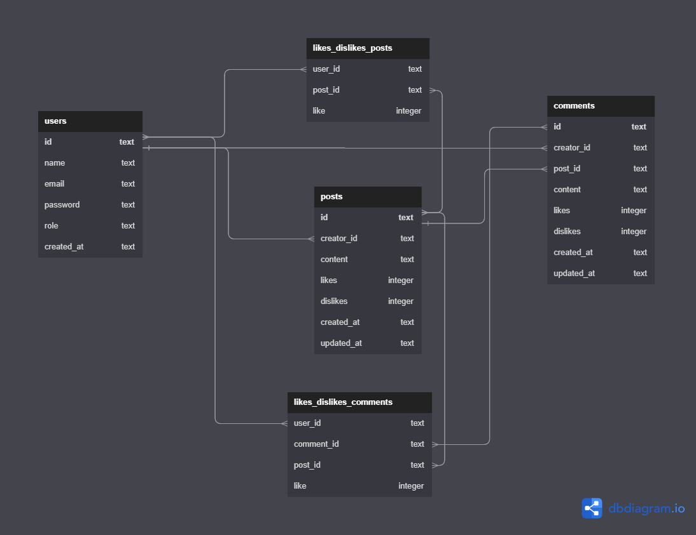

# Labeddit-back-end 

---

## 📑Introdução

    Esse é um projeto de uma rede social chamada Labeddit. 
    É uma rede social que tem como objetivo promover a conexão a interação entre pessoas. As pessoas que se cadastram no aplicativo podem criar posts e curtir publicações.
    O labeddit é um projeto Full Stack, sendo desenvolvido com Mobile First, com foco na arquitetura e desenvolvimento web e também o direcionamento aos dispositivos móveis.     
---

## 📸 Imagem do diagrama do banco de dados

---

## ⚙️Tecnologias utilizadas

1. ``Node``
2. ``Typescript``
3. ``Express``
4. ``SQL e SQLite``
5. ``Knex``
6. ``Postman``
7. ``POO``
8. ``Arquitetura em camadas``
9. ``Geração de UUID``
10. ``Geração de hashes``
11. ``Autenticação e autorização``
12. ``Roteamento``
12. ``Jest``

---

## 📱Funcionabilidades do Projeto

- [x] Endpoints:
- signup
- login
- get posts
- create post
- edit post
- delete post
- like / dislike post
- create comments
- like/ dislike comment  
 

- [x] Autenticação e autorização:
- identificação UUID
- senhas hasheadas com Bcrypt
- tokens JWT
 

- [x] Código:
- POO
- Arquitetura em camadas
- Roteadores no Express
 

---

## ✒️Aplicações utilizadas

- Postman
- Render

---

## 📋Documentação

- ``Postman`` <https://documenter.getpostman.com/view/24461105/2s93RL2wkA>

---

## 💻 Repositório Front-End

- GitHub <https://github.com/AlineBCBenjamim/Labeddit-front-end>

---

## 📀Rodando o Projeto

- Rode o console na pasta em que você baixou os arquivos;

- Insira o comando ``npm install``;

- Depois, o comando ``npm run dev`` para rodar no navegador.
